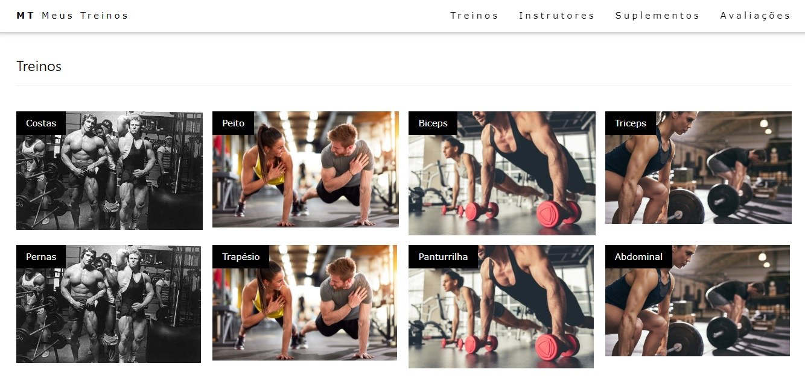

<h4 align="center"> 
	🚧 Meus Treinos 🚀
</h4>

  

    

- Aplicação para armazenar as fichas de treinos que realizei para visualizar o progresso nos treinos e assim, aperfeiçoar as informações como quanto tempo fez determinada ficha, quais dias cada treino foi realizado e outros acompanhamentos que forem interessantes registrar.
- Descrever minha rotina de suplementos, alimentação, horários de treinos e metas de atividades físicas.
- Instrutores e personal trainers
- Informações das avaliações para visualizar os avanços
- Permitir visualizar em dispositivos: smartphones, tablets e desktops.

### Design

- [Design do Projeto](https://www.w3schools.com/w3css/tryit.asp?filename=tryw3css_templates_architect&stacked=h)
- [Descrição do Projeto](https://www.notion.so/Desafio-02-Upload-de-imagens-4cf1c3b1c1ad4a66961b6e48558cc3b8#498432d3b4634947ba370f5d038e0961)
- [Código Template](https://github.com/rocketseat-education/ignite-template-reactjs-upload-de-imagens)
- [Figma](https://www.figma.com/file/hxxdmeGz2nhYvVOJzuoLJu/Desafio-2-M%C3%B3dulo-4-ReactJS-(Copy)?node-id=0%3A1&t=HK4rJE4veVoQI1wz-0)

### Meu primeiro treino

#### Treino A Pernas

Agachamento 5 X 8-10 reps – Intervalo 45” a 1’  
Leg Press 4 X 8-10 reps – Intervalo 45” a 1’  
Extensora 3 X 8-10 reps – Intervalo 45” a 1’  
Stiff 4 X 8-10 reps – Intervalo 45” a 1’  
Mesa flexora 3 X 8-10 reps – Intervalo 45” a 1’  
Extensora lombar 3 X 8-10 reps – Intervalo 45” a 1’  
Panturrilha 4 X 8-10 reps – Intervalo 45” a 1’

#### Treino B Empurrar

Supino – 5 X 8-10 reps – Intervalo 45” a 1’  
Supino inclinado halteres – 4 X 8-10 reps – Intervalo 45” a 1’  
Peck deck fly – 3 X 8-10 reps – Intervalo 45” a 1’  
Desenvolvimento – 4 X 8-10 reps – Intervalo 45” a 1’  
Elevação lateral – 3 X 8-10 reps – Intervalo 45” a 1’  
Mergulho – 4 X 8-10 reps – Intervalo 45” a 1’  
Tríceps corda – 3 X 8-10 reps – Intervalo 45” a 1’

#### Treino C Puxar

Barra fixa ou graviton 5 X 8-10 reps – Intervalo 45” a 1’  
Remada baixa no triângulo 4 X 8-10 reps – Intervalo 45” a 1’  
Puxada alta 3 X 8-10 reps – Intervalo 45” a 1’  
Rosca alternada 4 X 8-10 reps – Intervalo 45” a 1’  
Rosca direta no cabo 3 X 8-10 reps – Intervalo 45” a 1’  
Abdominal crunch máquina 3 X 8-10 reps – Intervalo 45” a 1’  
Abdominal oblíquo máquina 3 X 8-10 reps – Intervalo 45” a 1’

### Inspirações de Template

- [Inspirações 1 - Aplicativo para montar treino](https://aplicativonexur.com.br/aplicativo-para-montar-treino/)
- [Inspirações 2 - 8 aplicativos que ajudam a controlar o exercício físico](https://www.oswaldocruz.com/site/dicas-de-saude/dicas-de-saude/8-aplicativos-que-ajudam-a-controlar-o-exercicio-fisico)
- [Inspirações 3 - As 9 Melhores Apps de Fitness Grátis](https://www.boomfit.com/pt/blog/melhores-apps-de-fitness-b22.html)
- [Inspirações 4 - 5 aplicativos para fazer exercícios](https://canaltech.com.br/apps/aplicativos-fazer-exercicios/)
- [Inspirações 5 - TEMA SITE HTML PARA ACADEMIA](https://reidostemplates.com.br/produto/template-html-para-academias/)
- [Inspirações 6 - Treino ABC: a divisão perfeita para você virar um monstro!](https://www.feitodeiridium.com.br/treino-abc/)
- [Inspirações 7 - Quiz Treino](https://quiz.betterme.world/pt/first-page-generated?flow=505)
- [Inspirações 8 - gestão de planilhas e treinos esportivos](https://chelso.com.br/site/conheca-os-5-melhores-aplicativos-para-gestao-de-planilhas-e-treinos-esportivos/)
- [Inspirações 9 - treino de musculação, condicionamento e yoga](https://www.almanaquesos.com/os-20-melhores-aplicativos-gratuitos-para-treino-de-musculacao-condicionamento-e-yoga-em-casa/)
- [Inspirações 10 - Fichas Para Hipertrofia Máxima](https://www.basefitness.com.br/treino-abcd/)

## Tarefas

- [x] favicon
- [x] design inicial estático
- [ ] inserir detalhes de informações ao clicar nos cards
- [ ] essas informações devem estar em objetos json
- [ ] formulário de contato enviando para email 
- [ ] formulário de contato cadastrando em newsletter
- [ ] criar CRUD para tirar foto do ficha de treino

### Telas

   

